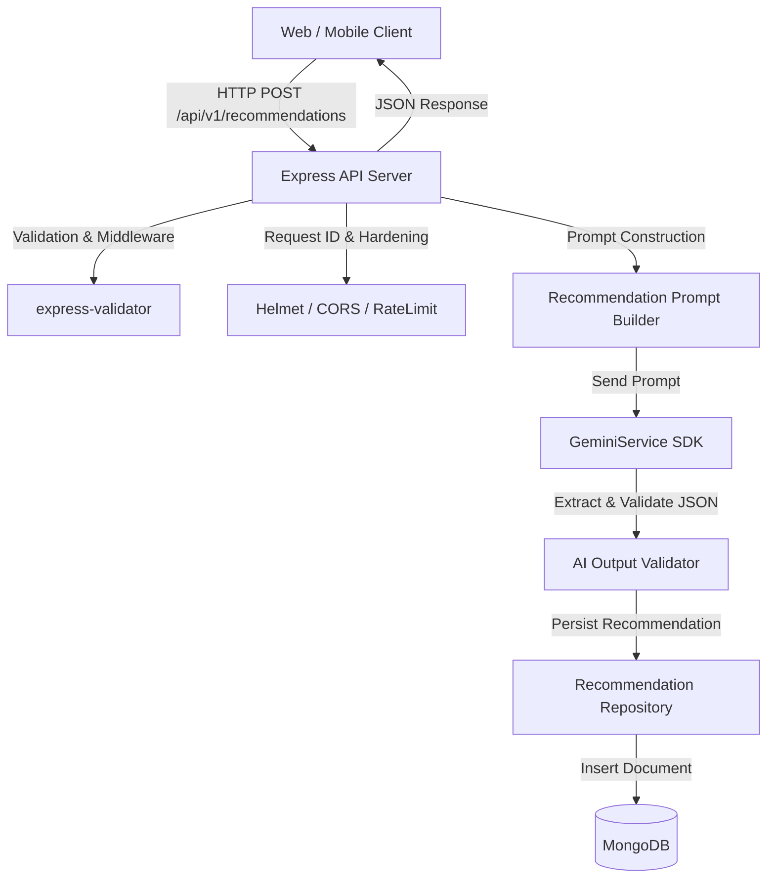

# CareerPilot AI Backend API

[](https://nodejs.org/)
[](LICENSE)
[]()

Production-grade Node.js/Express backend API for **CareerPilot AI**, providing personalized AI-driven career recommendations powered by Google Gemini AI with MongoDB persistence.

---

## 📖 Architecture & System Overview



---

## ✨ Features

- **Google Gemini AI Integration**: Dynamic fallback probing (`gemini-2.5-flash`, `gemini-2.5-flash-lite`, `gemini-2.0-flash`, `gemini-1.5-flash`) with exponential backoff retries.
- **Strict Response Validation**: Validates, sanitizes, deduplicates skills, and clamps AI confidence scores before persistence.
- **MongoDB Persistence**: Mongoose schema storing user profile inputs, AI recommendations, and performance metadata.
- **Production Hardening**: Security headers (`helmet`), configurable CORS, rate limiting, request size limits (`10kb`), and gzip compression (`compression`).
- **Distributed Request Tracing**: Every request is assigned or reuses a unique `X-Request-ID` correlated across Pino JSON logs.
- **Health & Readiness Endpoints**: Liveness (`GET /health`) and internal non-network readiness (`GET /ready`) monitoring.

---

## 🛠️ Technology Stack

- **Runtime**: Node.js (v18+)
- **Framework**: Express.js (v4.19)
- **AI SDK**: `@google/generative-ai` (v0.24)
- **Database**: MongoDB & Mongoose ODM (v8.3)
- **Logging**: Pino & `pino-http` (v10.3)
- **Security & Utilities**: Helmet, CORS, Express-Rate-Limit, Compression, Express-Validator

---

## 📁 Folder Structure

```text
backend/
├── docs/
│   ├── openapi.json           # OpenAPI 3.0 (Swagger) specification
│   └── postman_collection.json# Postman API Collection
├── src/
│   ├── config/                # Environment & Database configuration
│   ├── constants/             # HTTP status codes & error constants
│   ├── controllers/           # HTTP Request handlers
│   ├── middleware/            # Hardening, RequestId, Logger & Error handlers
│   ├── models/                # Mongoose database schemas
│   ├── prompts/               # System & User prompt templates
│   ├── repositories/          # Database data-access layer
│   ├── routes/                # Express router declarations
│   ├── services/              # Gemini SDK & Recommendation business logic
│   ├── validators/            # Input & AI payload validation
│   ├── app.js                 # Express application configuration
│   └── server.js              # Server entrypoint & graceful shutdown
├── Dockerfile                 # Multi-stage production container image
├── docker-compose.yml         # Local development orchestration
├── DEPLOYMENT.md              # Deployment guide (Docker, Render, Railway)
├── RELEASE_CHECKLIST.md       # Pre-release deployment verification checklist
├── CHANGELOG.md               # Version release history
├── .env.example               # Environment variable documentation template
└── package.json               # Node.js dependencies & scripts
```

---

## 🚀 Quick Start (Running Locally)

### Prerequisites
- Node.js >= 18.0.0
- MongoDB instance running locally (`mongodb://localhost:27017`) or MongoDB Atlas URI
- Gemini API Key from [Google AI Studio](https://aistudio.google.com/)

### 1. Installation
```bash
# Clone the repository and navigate to backend directory
cd careerrecommendation-main/backend

# Install dependencies
npm install
```

### 2. Environment Setup
Copy `.env.example` to `.env` and fill in your Gemini API key:
```bash
cp .env.example .env
```

Edit `.env`:
```env
PORT=5000
NODE_ENV=development
MONGODB_URI=mongodb://localhost:27017/careerpilot
GEMINI_API_KEY=your_actual_gemini_api_key_here
```

### 3. Run Development Server
```bash
npm run dev
```

The server starts at `http://localhost:5000` with hot-reloading.

---

## 🧪 Running Tests

```bash
# Run Phase 6 Production Hardening Test Suite (15/15 PASS)
node test-phase6.js

# Run API & AI Quality Verification Test Suite (22/22 PASS)
node test-api-suite.js
```

---

## 📡 API Overview

| Method | Endpoint | Description |
| :--- | :--- | :--- |
| `GET` | `/health` | Liveness check returning uptime, version, and requestId |
| `GET` | `/ready` | Readiness check validating MongoDB & Gemini API config |
| `POST` | `/api/v1/recommendations` | Generate personalized career recommendation |

### Example Request (`POST /api/v1/recommendations`)
```json
{
  "skills": ["JavaScript", "React", "Node.js"],
  "interests": ["Frontend Development", "UI/UX Design"],
  "education": "Bachelor of Science in Information Technology",
  "experience": "1 year as a junior web developer",
  "careerGoals": "Frontend Lead specializing in modern web apps"
}
```

---

## 🐳 Docker Support

```bash
# Build production Docker image
docker build -t careerpilot-backend .

# Run container locally
docker run -d -p 5000:5000 --env-file .env --name careerpilot-api careerpilot-backend
```

---

## 📄 License & Versioning

- **Version**: 1.0.0
- **License**: MIT
