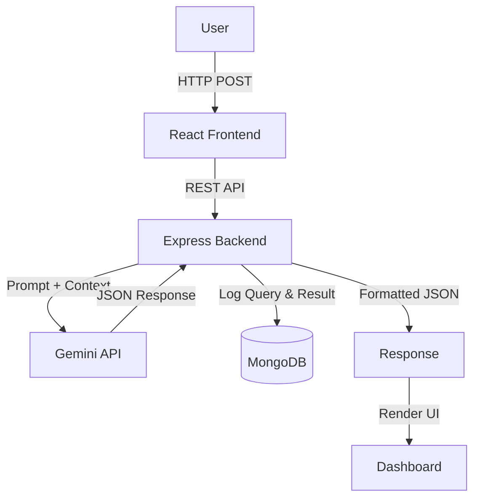

# Architecture Design Document
**Project Name**: CareerPilot AI  
**Author**: Software Architect  

---

## 1. Architecture Overview
CareerPilot AI is designed as a modern, decoupled web application. The frontend is a Multi-Page Application (MPA) built with React and React Router that communicates with a RESTful Express.js API. The backend acts as a secure proxy and orchestrator—it validates client requests, dynamically builds prompts, queries the Google Gemini API, and persists the interactions to a MongoDB database before returning the structured response to the user. This architecture protects sensitive API keys, ensures scalability, and allows for asynchronous background tasks (like database logging) without blocking the user experience.

## 2. High-Level Architecture


### Project Folder Tree
```text
careerpilot-ai/
├── docs/
├── frontend/
├── backend/
├── docker/
├── .env.example
├── docker-compose.yml
└── README.md
```

## 3. Frontend Architecture
The frontend is structured to support a full multi-page experience while remaining lightweight.

### Routing Architecture
- **Router**: The application strictly uses `react-router-dom` (`BrowserRouter`) to handle client-side routing.
- **Layouts**: A global `MainLayout` component wraps all routes to provide a persistent Navbar and Footer across pages.
- **Navigation**: Uses `<Link>` and `<NavLink>` components to navigate between routes without full browser reloads, ensuring smooth transitions.

### State Management & Data Flow
- **Context API**: `RecommendationContext` acts as the global data store.
- **Data Flow**: When a user submits the Assessment Form, the result is saved in the Context. As the user navigates from the Results Dashboard to Career Details or the Learning Roadmap, these pages read the shared data directly from the Context rather than re-fetching from the backend. This keeps the application snappy and avoids redundant API calls.

### Pages & Interaction

**1. Home (`/`)**
- **Purpose**: Landing page explaining the value proposition.
- **Components**: `HeroBanner`, `CallToAction`, `TestimonialSnippet`.
- **Data Flow**: Static rendering.
- **Navigation**: Links to Assessment, About, Features.
- **API Requirements**: None.

**2. About (`/about`)**
- **Purpose**: Information about the platform and its AI-driven approach.
- **Components**: `TeamInfo`, `MissionStatement`.
- **Data Flow**: Static rendering.
- **Navigation**: Standard Navbar links.
- **API Requirements**: None.

**3. Features (`/features`)**
- **Purpose**: Overview of platform capabilities.
- **Components**: `FeatureGrid`, `FeatureCard`.
- **Data Flow**: Static rendering.
- **Navigation**: Links to Assessment.
- **API Requirements**: None.

**4. Career Assessment (`/assessment`)**
- **Purpose**: The main input form for skills, interests, and background.
- **Components**: `AssessmentForm`, `FormInput`, `SubmitButton`.
- **Data Flow**: Local state (`useState`) handles form typing. On submit, data is dispatched to `RecommendationContext` and sent to the backend.
- **Navigation**: Redirects to `/results` on successful API response.
- **API Requirements**: `POST /api/v1/recommendations`. (This is the primary page communicating with the backend).

**5. Results Dashboard (`/results`)**
- **Purpose**: Overview of top career recommendations.
- **Components**: `ResultCardGrid`, `ResultCard`, `LoaderSpinner` (if waiting for API).
- **Data Flow**: Reads the `recommendations` array from `RecommendationContext`.
- **Navigation**: Clicking a card links to `/career/:id`.
- **API Requirements**: Only if deeply linked (needs state hydration; for MVP, redirects to `/assessment` if Context is empty).

**6. Career Details (`/career/:id`)**
- **Purpose**: Deep dive into a specific career recommendation (Reasoning, etc.).
- **Components**: `CareerHeader`, `SkillGapList`.
- **Data Flow**: Filters the Context array by the `:id` param to display specific data.
- **Navigation**: Links to `/roadmap/:id` or back to `/results`.
- **API Requirements**: None (reads from Context).

**7. Learning Roadmap (`/roadmap/:id`)**
- **Purpose**: Step-by-step actionable plan for the selected career.
- **Components**: `TimelineView`, `ResourceLinks`.
- **Data Flow**: Reads `learningRoadmap` data from Context for the specific career.
- **Navigation**: Back to `/career/:id`.
- **API Requirements**: None.

**8. FAQ (`/faq`)**
- **Purpose**: Frequently asked questions about the service.
- **Components**: `Accordion`, `FAQItem`.
- **Data Flow**: Renders a static array of questions/answers.
- **Navigation**: Standard links.
- **API Requirements**: None.

**9. Contact (`/contact`)**
- **Purpose**: Basic contact information or support form.
- **Components**: `ContactForm`, `SocialLinks`.
- **Data Flow**: For MVP, this is a static `mailto:` link or a dummy UI form.
- **Navigation**: Standard links.
- **API Requirements**: None (in MVP).

**10. 404 Not Found (`*`)**
- **Purpose**: Catch-all route for invalid URLs.
- **Components**: `NotFoundMessage`, `BackHomeButton`.
- **Data Flow**: None.
- **Navigation**: Link to `/`.
- **API Requirements**: None.

## 4. Backend Architecture
The backend enforces a strict request lifecycle to decouple routing, validation, and business logic.
- **Folder Structure**: Organized by technical concern (`routes`, `controllers`, `services`, `models`, `validators`, `middleware`).
- **Request Lifecycle**: `Route -> Validation Middleware -> Controller -> Service Layer -> MongoDB -> Controller -> Response`.
- **Controllers**: Responsible strictly for HTTP concerns—extracting parameters and formatting responses.
- **Services**: Contains core business logic. `geminiService.js` handles all AI orchestration.
- **Validators**: Uses schemas (e.g., Joi or Zod) to validate `req.body` before processing.
- **Middleware**: Global error handling middleware intercepts thrown errors and formats them into standard JSON responses.
- **Database Layer**: Uses Mongoose ODM to enforce schema validation on MongoDB documents.
- **Gemini Integration**: Uses the official `@google/generative-ai` SDK encapsulated entirely within the service layer.

## 5. Database Architecture
Since the MVP has no user authentication, the database is optimized for anonymous logging and future analytics.
- **Collection**: `Recommendations`
- **Fields**:
  - `_id`: ObjectId (Primary Key)
  - `userInput`: Object containing `skills` (Array), `interests` (Array), `education` (String)
  - `aiResponse`: Object matching the expected AI JSON format
  - `processingTime`: Number (ms taken by Gemini to respond)
  - `model`: String (e.g., "gemini-1.5-pro")
  - `createdAt`: Date (Automatically set to `Date.now`)
- **Relationships**: None required for MVP.
- **Future Scalability**: When Auth is added, a `userId` field (indexed) will be appended to link records to specific users.

## 6. API Architecture
All endpoints use a standardized response format: `{ "success": boolean, "message": string, "data": object }`.

### `POST /api/v1/recommendations`
- **Purpose**: Accepts user profile data, fetches AI recommendations, and logs to the DB.
- **Request Body**:
  ```json
  {
    "skills": ["JavaScript", "Docker"],
    "interests": ["Cloud Architecture"],
    "education": "B.S. Computer Science"
  }
  ```
- **Success Response** (200 OK):
  ```json
  {
    "success": true,
    "message": "Recommendations generated",
    "data": { "careerRecommendations": [...], "skillGap": [...], "learningRoadmap": [...], "interviewTips": [...] }
  }
  ```
- **Error Responses**:
  - `400 Bad Request`: Invalid input body.
  - `500 Internal Server Error`: Backend logic or database failure.
  - `503 Service Unavailable`: Gemini API timeout or rate limit.

### `GET /api/v1/health`
- **Purpose**: Load balancer health check.
- **Request Body**: None.
- **Success Response** (200 OK): `{ "success": true, "message": "System is healthy", "data": { "status": "up" } }`

### Reserved Future Endpoints
- **`GET /api/v1/recommendations/:id`**: Fetch a specific recommendation by ID.
- **`GET /api/v1/history`**: Fetch the recommendation history for the authenticated user.
- **`DELETE /api/v1/history/:id`**: Delete a specific recommendation from history.

## 7. AI Architecture
- **Prompt Flow**: User inputs are sanitized and injected into a rigid, system-level prompt template.
- **Gemini Request Flow**: The backend sends the prompt requesting a `application/json` output format using Gemini's structured generation capabilities if available, or strict text prompting.
- **JSON Validation**: The backend attempts to `JSON.parse` the AI response. It then validates that required keys (`careerRecommendations`, `skillGap`) exist.
- **Retry Strategy**: If the AI returns malformed JSON, the service catches the error and executes exactly one automated retry before returning a 503 error to the client.
- **Error Handling**: Implements a strict 15-second timeout on the AI request to prevent infinite hanging on the client.

## 8. Security Architecture
- **Environment Variables**: Sensitive credentials are never committed to version control.
- **API Key Protection**: The Gemini API is strictly queried from the Node.js backend. The frontend is entirely unaware of the API keys.
- **Input Validation**: All incoming requests are sanitized to prevent NoSQL injection and prompt injection attacks.
- **CORS**: Configured in Express to only accept requests from the specific `CLIENT_URL`.
- **Helmet**: Express Helmet middleware is used to set secure HTTP headers (XSS protection, no-sniff, etc.).
- **Rate Limiting**: `express-rate-limit` is applied to `POST /api/v1/recommendations` (e.g., 5 requests per minute per IP) to prevent malicious draining of Gemini API quotas.

## 9. Deployment Architecture
- **Docker**: The application is containerized using multi-stage builds. The Node.js backend runs on an `alpine` image, and the React frontend is built and served via a lightweight `nginx` container.
- **Docker Compose**: Orchestrates the frontend, backend, and a local MongoDB instance for seamless local development and testing.
- **AWS Deployment**: Containers will be deployed to a single EC2 instance (or Elastic Beanstalk) using Docker Compose. A reverse proxy (Nginx) on the host routes traffic to the respective containers.
- **Health Check Endpoint**: AWS Target Groups will ping `/api/v1/health` every 30 seconds to route traffic away from failing containers.

## 10. Environment Variables
The following `.env` file must be present on the backend server:
```env
PORT=5000
MONGODB_URI=mongodb://localhost:27017/careerpilot
GEMINI_API_KEY=your_gemini_api_key_here
GEMINI_MODEL=gemini-2.5-flash
CLIENT_URL=http://localhost:5173
NODE_ENV=development
REQUEST_TIMEOUT=15000
RATE_LIMIT_WINDOW=60000
RATE_LIMIT_MAX=5
```

## 11. Development Phases
- **Phase 1: Project Setup**: Initialize Git, React Vite, Express boilerplate, and establish folder structures.
- **Phase 2: Backend**: Configure Express, Middleware, MongoDB connection, and basic Routing.
- **Phase 3: Frontend**: Build out UI components, Forms, and State Management.
- **Phase 4: AI Integration**: Develop Prompt Engineering, Gemini Service, and wire up the API between frontend and backend.
- **Phase 5: Docker**: Write Dockerfiles and `docker-compose.yml`; verify local containerized execution.
- **Phase 6: AWS Deployment**: Provision EC2, configure security groups, pull images, and launch.

## 12. Logging Strategy
- **Morgan**: HTTP request logging middleware for Express.
- **Console Logger**: Standard output for development debugging.
- **Error Logger**: Captures stack traces for unhandled exceptions.
- **Request Logger**: Tracks API usage and payload metadata asynchronously.

## 13. Future Scalability
The architecture is designed to gracefully support post-MVP features:
- **Authentication & User Accounts**: By adding JWT middleware (e.g., Passport.js), we can introduce a `Users` collection. The `Recommendations` collection can then simply add an indexed `userId` reference field.
- **Recommendation History**: A new `GET /api/v1/recommendations/history` endpoint can query MongoDB by the authenticated user's `userId` to populate a history dashboard.
- **Resume Upload**: The frontend can send multipart/form-data to the backend, which uploads the file to AWS S3, triggers a text-extraction lambda or service, and feeds the extracted text into the Gemini prompt.
- **Admin Dashboard**: By adding a `role` field to the `Users` collection, specific endpoints can be protected by an `isAdmin` middleware to view platform analytics and raw AI response logs.
