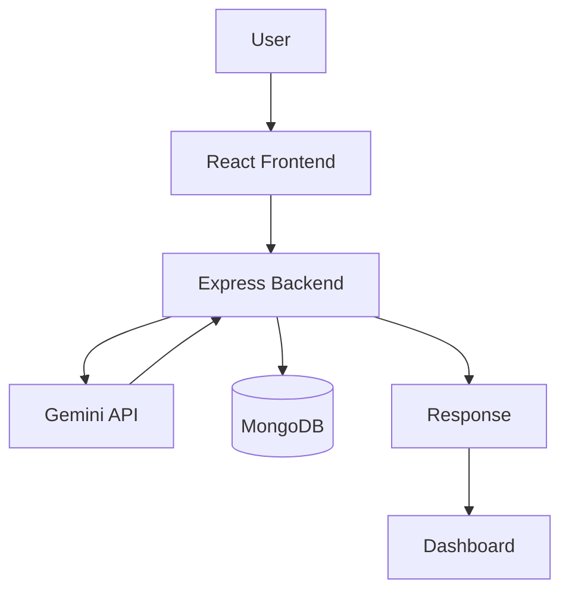

# Product Requirements Document (PRD)

**Project Name**: CareerPilot AI  
**Status**: Approved for MVP  
**Timeline**: 2 Days (Strict MVP)  

---

## 1. Product Vision
To deliver a premier, AI-powered personalized career guidance platform that empowers students and early-career professionals to navigate their futures with data-backed, actionable insights.

## 2. Problem Statement
Traditional career recommendation systems are inherently limited by static questionnaires and generalized decision trees, offering one-size-fits-all advice. Generative AI fundamentally improves this by analyzing nuanced, unstructured user inputs—such as unique combinations of skills, personal interests, and educational backgrounds—to generate highly tailored, contextual career paths that traditional systems cannot surface.

## 3. User Persona
**Alex (The Confused Graduate)**
- **Background**: Final-year college student majoring in Computer Science.
- **Goals**: Wants a quick, data-backed recommendation on what specific roles to target and what skills they are missing to get there.
- **Frustrations**: Overwhelmed by too many career options (Software Engineering, Data Science, PM, UX); finds generic advice unhelpful.
- **Expected Outcome**: Clear, personalized career path recommendations with a concrete skill gap analysis.

## 4. Functional Requirements
- **Input Validation**: System must validate user inputs (Skills, Interests, Education) before processing.
- **Loading State**: System must display a visual loading indicator while waiting for AI generation.
- **JSON Response Validation**: System must parse and strictly validate the AI's JSON output before returning it to the client.
- **MongoDB Logging**: System must log user inputs and generated recommendations to the database.
- **Error Handling**: System must gracefully handle AI failures and display user-friendly error messages.

## 5. Non-Functional Requirements
- **Security**: All API keys (especially Gemini) must reside strictly on the backend via environment variables.
- **Scalability**: The application architecture must support horizontal scaling via Docker containers.
- **Maintainability**: Code must be modularly structured with clear separation of concerns (routes, controllers, services).
- **Responsive Design**: The UI must be fully usable on both mobile and desktop devices.
- **Performance**: API responses should be optimized, avoiding unnecessary payload bloat.
- **Reliability**: The system must include fallback mechanisms and timeouts for AI service calls.

## 6. MVP Features
- **Landing Page**: Simple UI with a clear Call to Action.
- **Assessment Form**: Form capturing Skills, Interests, and Education.
- **Results Dashboard**: Displays top 3 AI-generated career paths, reasoning, and skill gap analysis.

## 7. Project Scope
This strictly bounds the MVP to prevent scope creep.

**Included in MVP**
- AI Career Recommendation
- Skill Gap Analysis
- Learning Roadmap
- MongoDB Logging
- Docker Deployment
- AWS Deployment

**Not Included**
- Authentication
- Resume Upload
- Admin Dashboard
- Payment
- Chatbot
- Notifications
- Social Login

## 8. UI Pages
The frontend will consist of the following dedicated pages:
- **Home**: Landing page explaining the value proposition.
- **About**: Information about the platform and its AI-driven approach.
- **Features**: Overview of platform capabilities.
- **Career Assessment**: The main input form for skills, interests, and background.
- **Results Dashboard**: Overview of top career recommendations.
- **Career Details**: Deep dive into a specific career recommendation.
- **Learning Roadmap**: Step-by-step actionable plan for the selected career.
- **FAQ**: Frequently asked questions about the service.
- **Contact**: Basic contact information or support form.
- **404 Not Found**: A catch-all route for invalid URLs.

## 9. Nice to Have Features (Post-MVP)
- Career Readiness Score.
- PDF Export of the career roadmap.
- Recommendation History (requires Authentication).
- Job Board Integration (e.g., LinkedIn API for live postings).

## 10. User Flow
1. **Home**
2. ↓ **Assessment Form**
3. ↓ **Validation** (Client-side & Server-side)
4. ↓ **Loading** (Visual feedback to user)
5. ↓ **Gemini Processing** (AI generates recommendations)
6. ↓ **MongoDB Logging** (Save results asynchronously)
7. ↓ **Results Dashboard**
8. ↓ **Expand Recommendation**
9. ↓ **Skill Gap Analysis**

## 11. Success Criteria
Measurable goals for determining if the MVP is successful:
- **Response Time < 10 seconds**
- **Mobile Responsive**
- **Docker Build Successful**
- **AWS Deployment Successful**
- **Gemini Generates Valid JSON**
- **MongoDB Saves Every Request**
- **No Console Errors**
- **API Tested Successfully**

## 12. Technology Stack
- **Frontend**: React (Vite)
- **Backend**: Express.js, Node.js
- **Database**: MongoDB
- **AI**: Google Gemini API
- **Deployment**: Docker, AWS
- **Version Control**: Git / GitHub

## 13. System Architecture


## 14. Folder Structure
To enforce maintainability, the project will use the following structure:

```text
careerpilot-ai/
│
├── docs/
│
├── frontend/
│   ├── public/
│   ├── src/
│   │   ├── assets/
│   │   ├── components/
│   │   ├── layouts/
│   │   ├── pages/
│   │   ├── hooks/
│   │   ├── context/
│   │   ├── services/
│   │   ├── utils/
│   │   ├── styles/
│   │   └── routes/
│
├── backend/
│   ├── src/
│   │   ├── config/
│   │   ├── controllers/
│   │   ├── middleware/
│   │   ├── models/
│   │   ├── routes/
│   │   ├── services/
│   │   ├── validators/
│   │   ├── prompts/
│   │   ├── utils/
│   │   └── app.js
│
├── docker/
│
├── .env.example
│
├── docker-compose.yml
│
└── README.md
```

## 15. API Design
All endpoints will be versioned and use a standardized JSON response structure.

**Base Response Format:**
```json
{
  "success": true,
  "message": "Recommendations generated successfully",
  "data": {}
}
```

**`POST /api/v1/recommendations`**
- **Purpose**: Triggers Gemini API and returns career paths.
- **Payload**: `{ "skills": [], "interests": [], "education": "" }`
- **Success Response Data**: Array of recommendation objects (matching the AI Output Structure below).

**`GET /api/v1/health`**
- **Purpose**: Health check for AWS Load Balancers / Target Groups.
- **Success Response Data**: `{ "status": "healthy" }`

## 16. AI Output Structure
The backend must enforce that Gemini returns data in exactly this structure to ensure the frontend can render it reliably without breaking.

**Expected AI Response:**
```json
{
  "careerRecommendations": [
    {
      "title": "Software Engineer",
      "reason": "Matches your interest in coding and problem solving."
    }
  ],
  "skillGap": [
    "Docker", 
    "CI/CD"
  ],
  "learningRoadmap": [
    "Learn basic Docker containerization", 
    "Build a CI/CD pipeline"
  ],
  "interviewTips": [
    "Practice LeetCode",
    "Prepare system design questions"
  ]
}
```

## 17. Database Schema
Logs the recommendation requests for analytics and future features.

**Collection: `Recommendations`**
- `_id`: ObjectId
- `userInput`: Object (skills, interests, education)
- `aiResponse`: Object (matching AI Output Structure)
- `processingTime`: Number (ms taken by Gemini API)
- `model`: String (e.g., "gemini-1.5-pro")
- `createdAt`: Date (default Date.now)

## 18. Prompt Engineering Strategy
To ensure reliable interactions with the Gemini API, the backend will implement:
- **Structured JSON Output**: The prompt will explicitly demand a strict JSON schema array matching the AI Output Structure.
- **Prompt Templates**: A standardized template injecting user variables smoothly.
- **Output Validation**: The backend will parse the response and validate it against the expected schema before returning to the frontend.
- **Error Recovery**: Automatic retry logic for malformed JSON responses.
- **Token Optimization**: Concise prompting to reduce token usage and improve latency.

## 19. Error Handling
The backend will implement standardized HTTP error responses:
- **`400 Bad Request`**: Validation Error (e.g., missing skills/interests array).
- **`429 Too Many Requests`**: Rate Limit exceeded (if basic rate limiting is applied).
- **`500 Internal Server Error`**: Unexpected application or database failure.
- **`503 Service Unavailable`**: AI Service Unavailable (Gemini API timeout or outage).

## 20. Development Timeline

**Day 1**
- **Backend Setup**: Express boilerplate, routes, controllers.
- **Gemini**: Implement `geminiService` and prompt engineering strategy.
- **API**: Finalize `POST /api/v1/recommendations`.
- **Frontend Form**: Build Assessment form and connect to the API.

**Day 2**
- **Results UI**: Build the Results Dashboard and skill gap cards.
- **MongoDB**: Connect DB and implement logging.
- **Docker**: Containerize frontend and backend.
- **AWS**: Deploy containers and verify live functionality.
- **Testing**: End-to-end flow validation.
